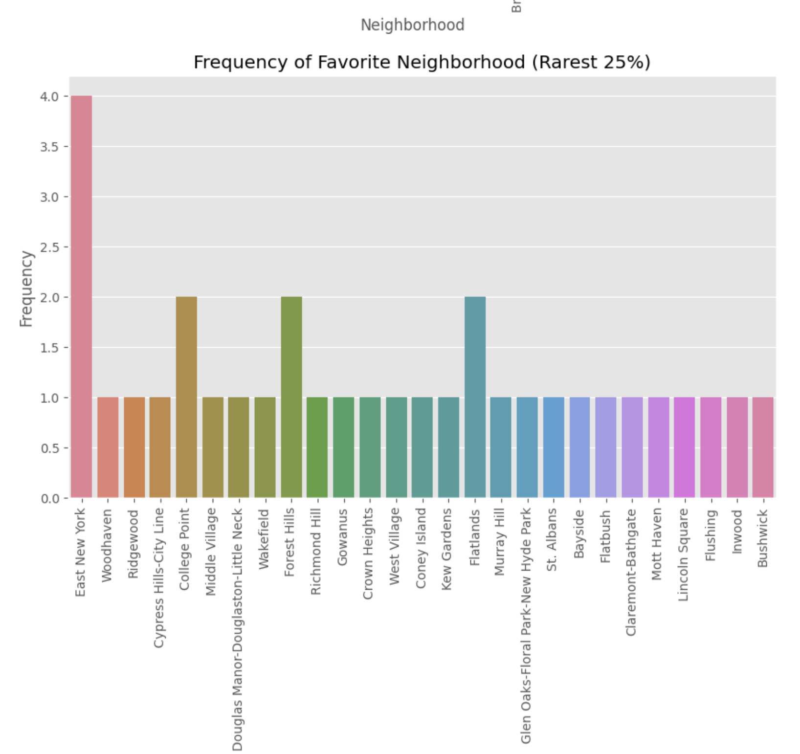

# NYC_trees_and_rent
Explorational data analysis on NYC tree census and rent

## objective: 
This project sought to find a relationship between rent in NYC neighborhoods and the trees found in those neighborhoods. My initial hypothesis was that trees in NYC neighborhoods with higher rent would be in better health, cause less damage to the sidewalks they are on, and have less problems overall. I was also curious to see if there could be any patterns recognized between tree species and rent. 

## the datasets: 
I used the tree census 2015 data oranized by NYC Parks & Recreation found on [NYC Open Data](https://data.cityofnewyork.us/Environment/2015-Street-Tree-Census-Tree-Data/pi5s-9p35)

I also used the Median Asking Rent of a one bedroom apartment in different NYC neighborhoods on StreetEasy listings, obtained [here](https://streeteasy.com/blog/data-dashboard/[object%20Object]?agg=Total&metric=Inventory&type=Sales&bedrooms=Any%20Bedrooms&property=Any%20Property%20Type&minDate=2010-01-01&maxDate=2024-03-01&area=Flatiron,Brooklyn%20Heights).

## Libraries Used: 
Pandas, numpy, matplotlib.pylab, seaborn, scipy 

## Data Preprocessing: 
My data cleaning included the following tasks: 
    - In the streeteasy dataset: 
        - kept only the rows where area type was listed as neighborhood (Streeteasy also had borough, submarket, city)  
        - created a column calculating the average median rent in 2015 and dropped other rent columns  
        - dropped rows with null values  
    - In the tree census dataset: 
        - removed rows where the tree was located in Staten Island, as StreetEasy had no data on Staten Island  
        - kept only relevant columns, as the tree census data 42 columns  
        - dropped null values  
    - Standardized and mapped neighborhood names from both datasets to allow for easier merging. 
    - Performed inner merges  
    - Grouped data by relevant metrics 

## EDA: 
In my exploratory data analysis I did the following: 
    - Feature analysis: 
        - Performed calculations for `correlation coefficient` and `p-value` on all quantitative features and rent  
        - Further explored the relationship between rent and a categorical feature like tree species. 
    - Identified and explored outliers and biases that could exist based on borough, performed seperate analysis by borough. 
    - Created visualizations to further understand data: 
        - 
        **key finding:** Every neighborhood except the Bronx exhibits a negative relationship between rent and total trees, indicating that higher-rent neighborhoods tend to have fewer trees.
        - 
        **key finding:** Rarer species of trees are generally equally distributed across neighborhoods. The outlier is East New York, but this is expected as East New York has the most trees by a significant margin. 
        - 
        **key finding:** this graph indicates that the Japanese Zelkova is the most common tree in Manhattan neighborhoods with lower rent and the Callery Pear is the most common tree in Manhattan neighborhoods with higher rent. However, it was found through further analysis that this pattern was only due to outlier neighborhoods.  

## Findings and conclusion:  
The data failed to reject the null hypothesis when it came to the relationship between rent and the features in the tree census. This was true when exploring data on total trees, the percentage of trees causing sidewalk damages, the percentage of trees with issues (roots, stones, wire/rope, metal grate, etc.), the health of the trees (good, fair, poor) and tree species.  
  
There was a minor `correlation` between total trees and rent in `Queens` neighborhoods `(-.355)` but the `p-value (.136) `indicates a lack of statistical significance. Interestingly, every borough had a negative correlation coefficient between total trees and rent, except for the Bronx. 
  
The general trend in New York is that the more expensive a neighborhood is, the less trees are in it. 
  
Additionally, while one might assume that the more expensive a neighborhood is to live in, the less problems those trees will have, every borough but `Manhattan` had a `positive correlation` between the rent and percentage of trees with problematic conditions.  The strongest relationship was in `Brooklyn`, where `correlation coefficient = .367` and `p-value = .05`, which is on the border for the threshold of statistical significance. 

## [Explore the Jupyter Notebook for detailed analysis](treesAndRent.ipynb)
